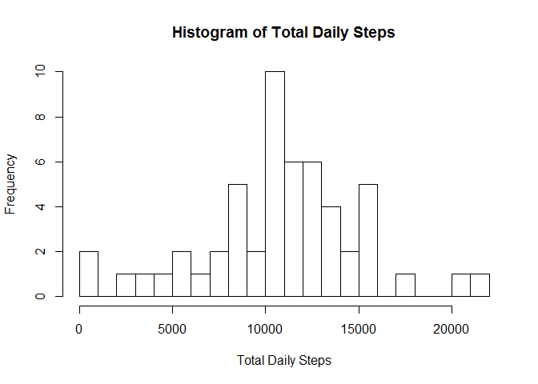
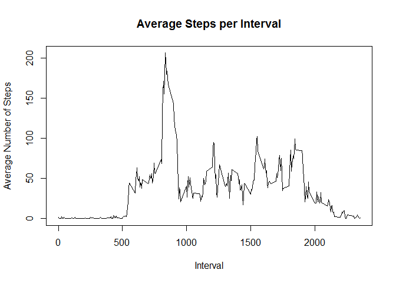
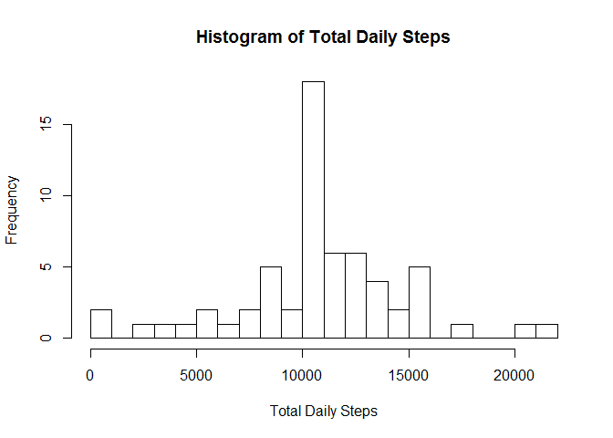
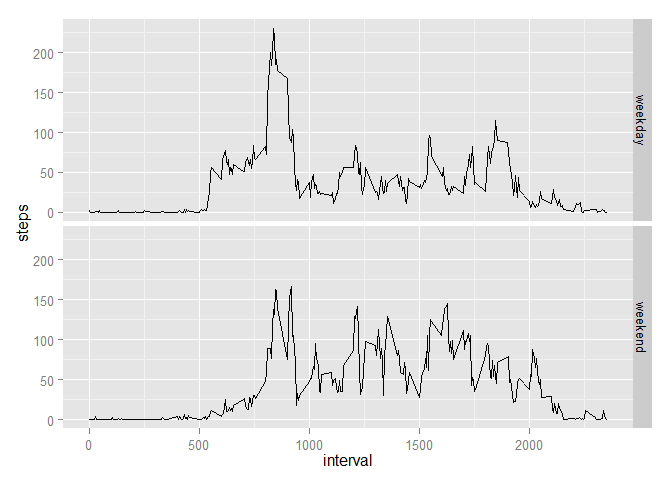

#Reproducible Research: Peer Assessment 1


### Loading and preprocessing the data

Reading the data

```r
data=read.csv("activity.csv")
```

Changing the date format

```r
data$date=as.Date(data$date,"%Y-%m-%d")
```

### What is the mean total number of steps taken per day?

Plotting the histogram of total steps taken per days

```r
TotalSteps=aggregate(steps ~ date, data = data, sum, na.rm = T)
hist(TotalSteps$steps,main="Histogram of Total Daily Steps",xlab="Total Daily Steps",breaks=20)
```

 

Computing the mean total number of steps taken per day

```r
MeanTotalSteps=mean(TotalSteps$steps, na.rm = T)
MeanTotalSteps
```

```
## [1] 10766.19
```

Computing the median total number of steps taken per day

```r
MedianTotalSteps=median(TotalSteps$steps, na.rm = T)
MedianTotalSteps
```

```
## [1] 10765
```

### What is the average daily activity pattern?

Plotting the time series of the number of average daily steps taken per 5-minute interval

```r
AvgSteps=aggregate(steps ~ interval, data = data, mean, na.rm = T)
plot(AvgSteps$steps~AvgSteps$interval,type="l",main="Average Steps per Interval",xlab="Interval",ylab="Average Number of Steps")
```

 


```r
IntMaxAvgStep=AvgSteps[which.max(AvgSteps$steps),1]
IntMaxAvgStep
```

```
## [1] 835
```
On average across all the days in the dataset, the 5-minute interval that contains the maximum number of steps is 835.

### Imputing missing values


```r
TotalMissing=sum(is.na(data))
TotalMissing
```

```
## [1] 2304
```

There are 2304 missing values in the dataset.

Replacing the NA values with the daily average number of steps for that interval

```r
newdata=data
for (i in 1:nrow(newdata)) {
    if (is.na(newdata[i,1])==TRUE) {
        newdata[i,1]=AvgSteps[which(AvgSteps[,1]==newdata[i,3]),2]
    }
}
head(newdata)
```

```
##       steps       date interval
## 1 1.7169811 2012-10-01        0
## 2 0.3396226 2012-10-01        5
## 3 0.1320755 2012-10-01       10
## 4 0.1509434 2012-10-01       15
## 5 0.0754717 2012-10-01       20
## 6 2.0943396 2012-10-01       25
```

Re-creating the histogram of the total number of steps taken each day, the mean and median total number of steps taken per day with the new dataset


```r
NewTotalSteps=aggregate(steps ~ date, data = newdata, sum)
hist(NewTotalSteps$steps,main="Histogram of Total Daily Steps",xlab="Total Daily Steps",breaks=20)
```

 

```r
mean(NewTotalSteps$steps)
```

```
## [1] 10766.19
```

```r
median(NewTotalSteps$steps)
```

```
## [1] 10766.19
```

The mean based on the new dataset without missing values is the same as before because the missing values are filled in using mean values calculated from the original dataset. However, the median differ slightly from before.

### Are there differences in activity patterns between weekdays and weekends?

Classify the days by weekday or weekend

```r
day=0
for (j in 1:nrow(newdata)) {
    d=weekdays(newdata[j,2])
    if (d=="Monday"|d=="Tuesday"|d=="Wednesday"|d=="Thursday"|d=="Friday") {
        day[j]="weekday"        
    }
    else {
        day[j]="weekend"
    }
}

Daydata=cbind(newdata,day)
```

Making a time series panel plot of the interval and the average number of steps taken, averaged across all weekday days or weekend days 


```r
library(ggplot2)
```

```
## Warning: package 'ggplot2' was built under R version 3.1.2
```

```r
IntAvgDayStep=aggregate(steps~day+interval,data=Daydata,mean)
qplot(interval,steps,data=IntAvgDayStep,geom="line",facets=day~.)
```

 
